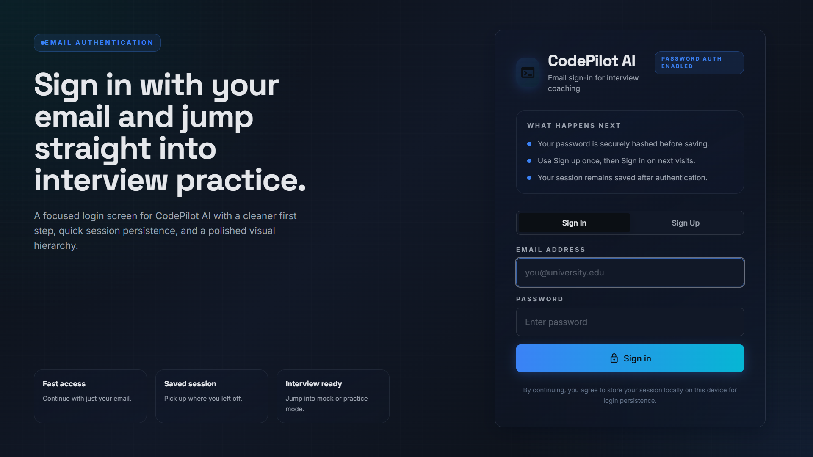
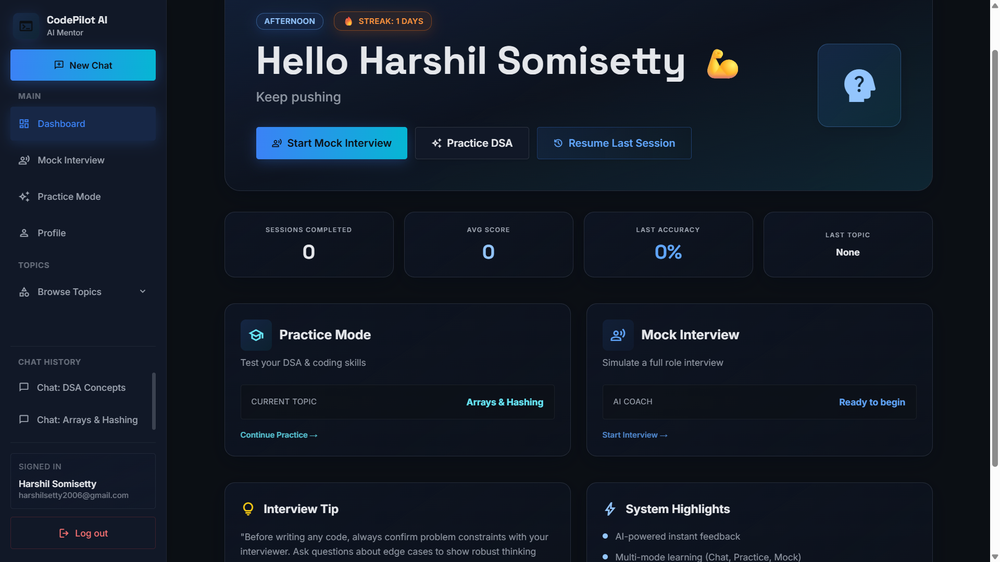
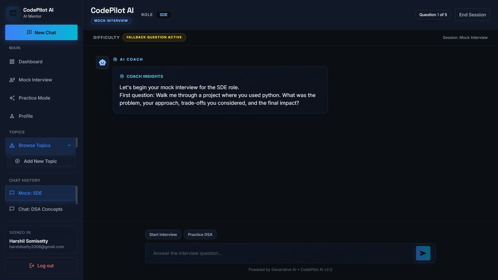
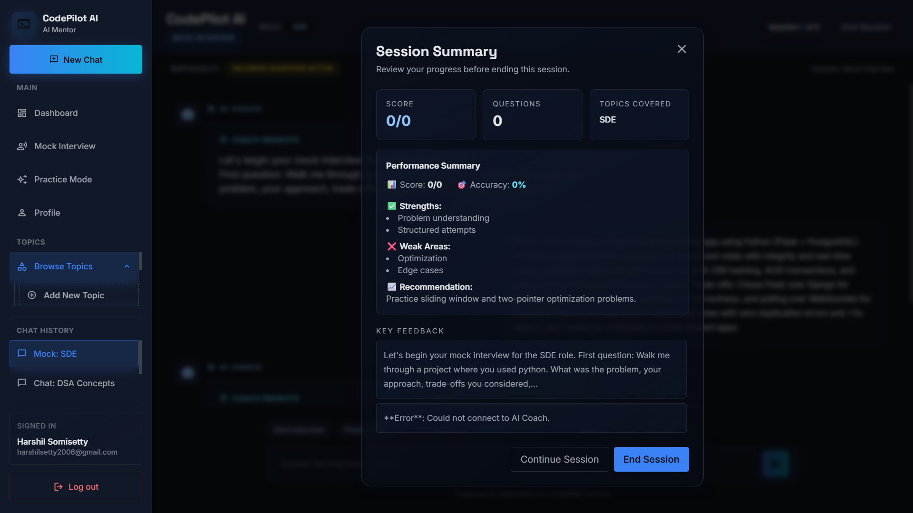
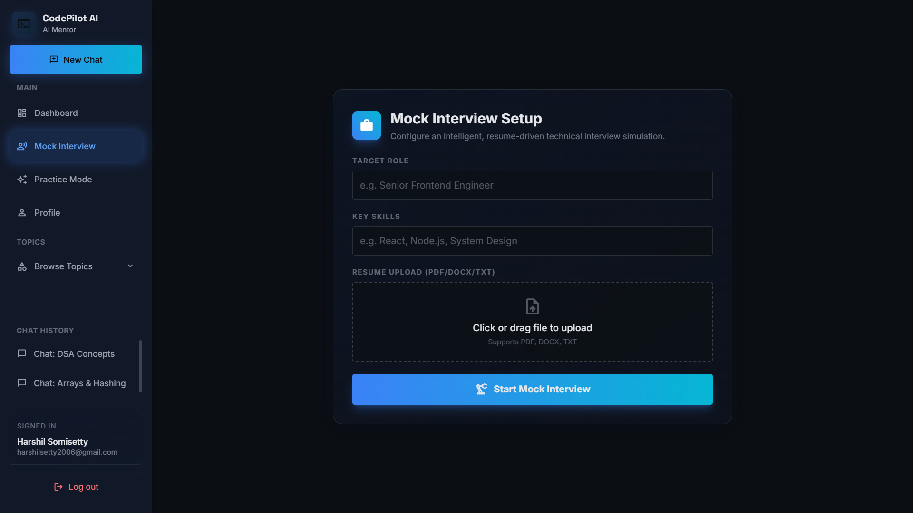
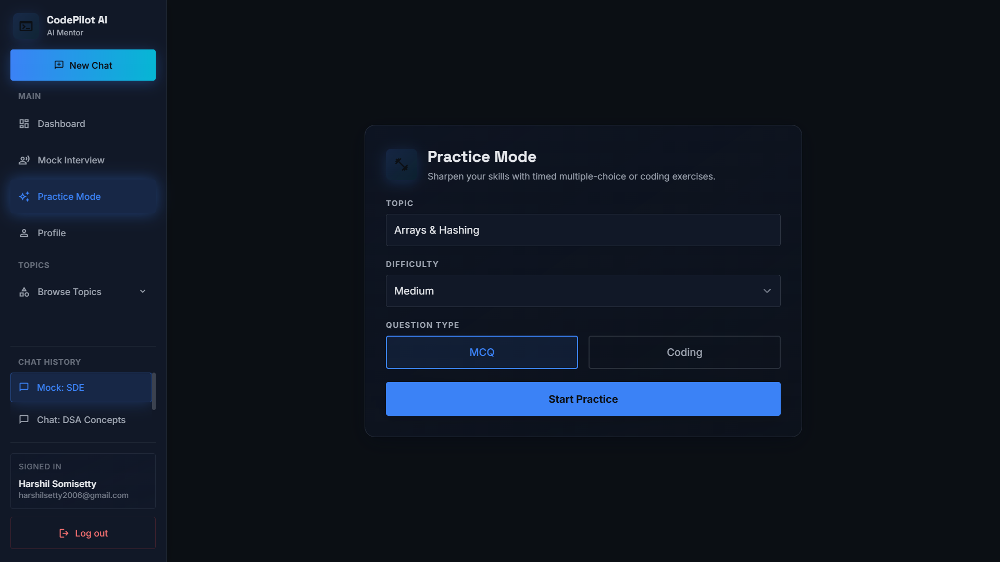
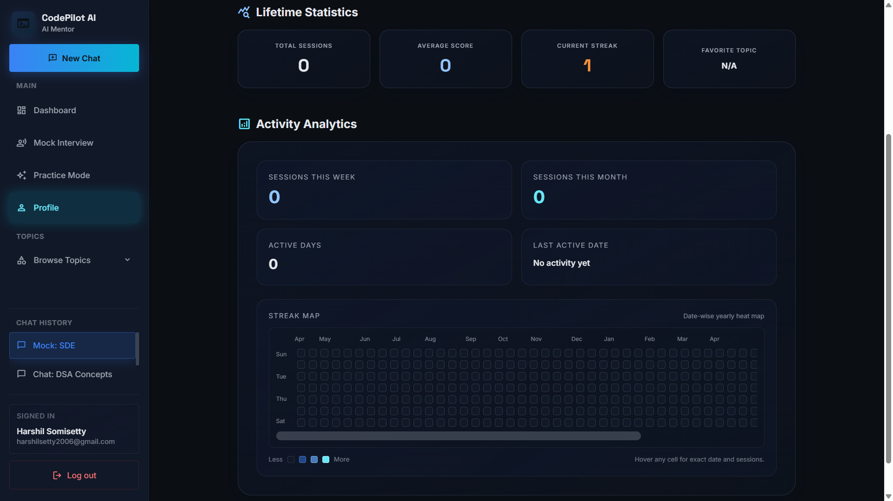

# CodePilot AI

CodePilot AI is an interview preparation platform that combines chat coaching, mock interviews, and practice evaluation using Google Gemini API.

## 1. Highlights
- Authentication with email/password and JWT.
- Mock interview mode using role + skills + resume context.
- Practice mode for MCQ and coding questions.
- Session summary after End Session.
- Dashboard analytics (sessions, average score, last score/accuracy/topic).
- Per-user session history and Resume Last Session.
- Daily streak tracking.
- Date-wise yearly heat map in Profile with hover details.

## 2. Tech Stack
- Frontend: React, Vite, Tailwind CSS
- Backend: Node.js, Express
- AI: Google Gemini (gemini-2.5-flash)
- Persistence: localStorage (analytics/history), users.json (backend auth users)

## 3. Project Structure
```text
backend/
  controllers/
  routes/
  utils/
  data/users.json
  server.js

frontend/
  src/components/
  src/api/client.js
  src/App.jsx

docs/
  REQUIREMENTS_SPECIFICATION.md
  ARCHITECTURE.md
  API.md
  WORKFLOWS_ALGOS.md
  METRICS_QUALITY.md
  RELEASE_READINESS_CHECKLIST.md
  OPERATIONAL_RUNBOOK.md
```

## 4. Setup

### Backend
1. Open terminal in backend.
2. Install packages:
  npm install
3. Create backend/.env with:
  GEMINI_API_KEY=your_key_here
  JWT_SECRET=your_secret_here
  PORT=3000
4. Run:
  npm run dev

If port 3000 is occupied, use:
PowerShell: $env:PORT=3001; npm run dev

### Frontend
1. Open terminal in frontend.
2. Install packages:
  npm install
3. Optional frontend/.env:
  VITE_API_BASE_URL=http://localhost:3000
4. Run:
  npm run dev

If 5173 is occupied, Vite automatically uses next port.

## 5. Verification Status (Latest)
- Frontend production build: PASS
- Backend startup on default 3000: FAIL (port already in use)
- Backend startup on alternate port 3001: PASS

## 6. API Endpoints
- POST /api/auth/register
- POST /api/auth/login
- POST /api/chat
- POST /api/mock
- POST /api/practice
- POST /api/practice/evaluate

Detailed API schema: docs/API.md

## 7. Documentation Pack
- Requirements specification: [docs/REQUIREMENTS_SPECIFICATION.md](docs/REQUIREMENTS_SPECIFICATION.md)
- Architecture and diagrams: [docs/ARCHITECTURE.md](docs/ARCHITECTURE.md)
- API spec: [docs/API.md](docs/API.md)
- Workflows and algorithms: [docs/WORKFLOWS_ALGOS.md](docs/WORKFLOWS_ALGOS.md)
- Metrics and checks: [docs/METRICS_QUALITY.md](docs/METRICS_QUALITY.md)
- Release readiness checklist: [docs/RELEASE_READINESS_CHECKLIST.md](docs/RELEASE_READINESS_CHECKLIST.md)
- Operational runbook: [docs/OPERATIONAL_RUNBOOK.md](docs/OPERATIONAL_RUNBOOK.md)
- Deployment guide: [docs/DEPLOYMENT.md](docs/DEPLOYMENT.md)

## 8. Deploy Prototype
For an internet-accessible prototype, use:
- Backend: Render
- Frontend: Vercel

Full setup steps: [docs/DEPLOYMENT.md](docs/DEPLOYMENT.md)

## 9. UI/UX Screenshots
Add product screenshots to `docs/screenshots/` and update filenames below as needed.

<table>
  <tr>
    <td align="center"><strong>Login</strong><br/></td>
    <td align="center"><strong>Dashboard</strong><br/></td>
  </tr>
  <tr>
    <td align="center"><strong>Chat</strong><br/></td>
    <td align="center"><strong>Session Summary</strong><br/></td>
  </tr>
  <tr>
    <td align="center"><strong>Mock Interview Setup</strong><br/></td>
    <td align="center"><strong>Practice Mode</strong><br/></td>
  </tr>
  <tr>
    <td align="center" colspan="2"><strong>Profile Heat Map</strong><br/></td>
  </tr>
</table>
