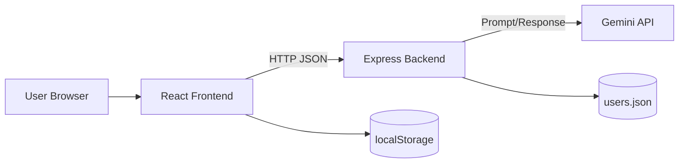
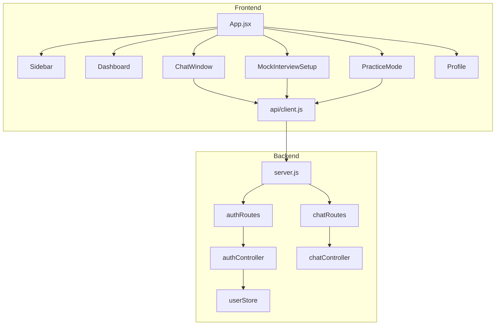
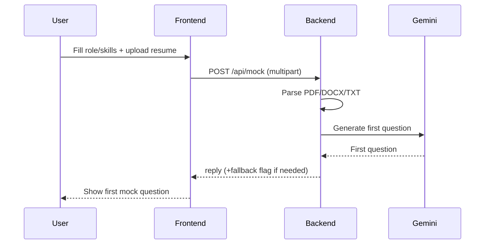
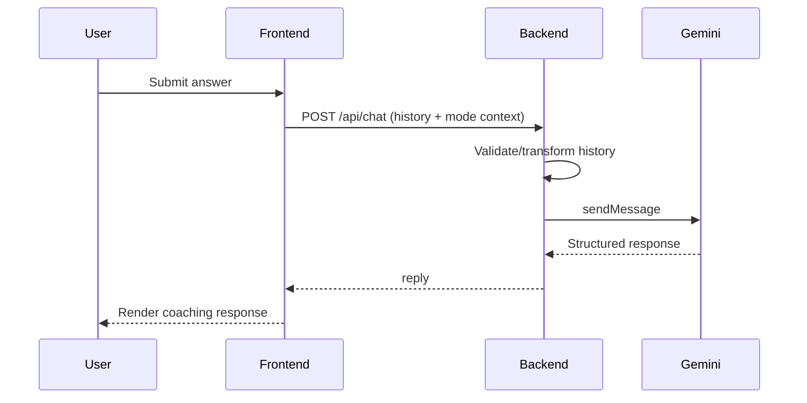

# Architecture and Diagrams

## 1. High-Level Architecture

## 2. Component View

## 3. Mock Interview Sequence

## 4. Chat Evaluation Sequence

## 5. Deployment Notes
- Frontend static assets: Vite build output in frontend/dist.
- Backend runtime: Node + Express service.
- Configuration: GEMINI_API_KEY, JWT_SECRET, PORT.
- Current local default ports: backend 3000, frontend 5173 (or next available).
